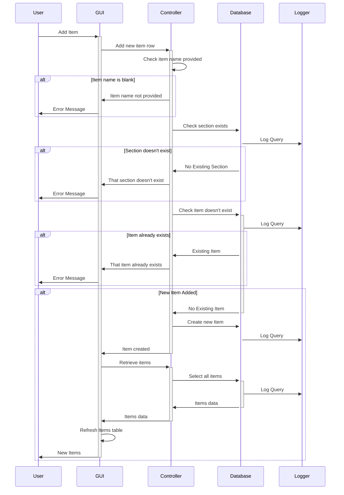

```mermaid
sequenceDiagram
    participant User
    participant GUI
    participant Controller
    participant Database
    participant Logger

    User->>+GUI: Add Item
    GUI->>+Controller: Add new item row
    Controller->>Controller: Check item name provided

    alt Item name is blank
        Controller->>GUI: Item name not provided
        GUI->>User: Error Message
    end

    Controller->>+Database: Check section exists
    Database->>Logger: Log Query

    alt Section doesn't exist
        Database->>Controller: No Existing Section
        Controller->>GUI: That section doesn't exist
        GUI->>User:Error Message
    end

    Controller->>+Database: Check item doesn't exist
    Database->>Logger: Log Query

    alt Item already exists
        Database->>Controller: Existing Item
        Controller->>GUI: That item already exists
        GUI->>User:Error Message
    end

    alt New Item Added
        Database->>-Controller: No Existing Item
        Controller->>Database: Create new Item
        Database->>Logger: Log Query
        Controller->>-GUI: Item created
        GUI->>+Controller: Retrieve items
        Controller->>+Database: Select all items
        Database->>Logger: Log Query
        Database->>-Controller: Items data
        Controller->>-GUI: Items data
        GUI->>GUI: Refresh Items table
        GUI->>-User:New Items
    end
```