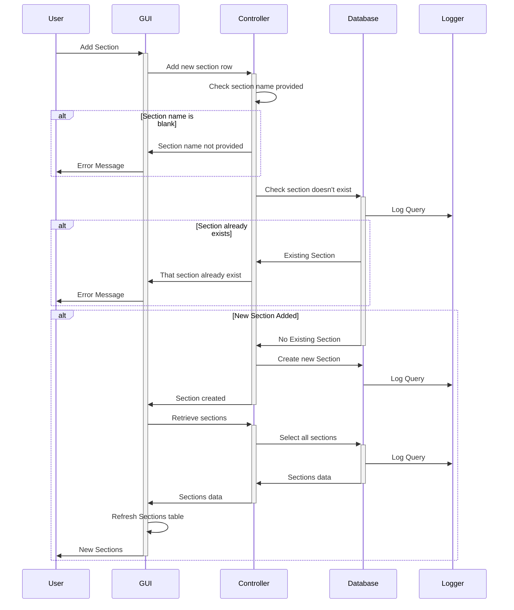

```mermaid
sequenceDiagram
    participant User
    participant GUI
    participant Controller
    participant Database
    participant Logger

    User->>+GUI: Add Section
    GUI->>+Controller: Add new section row
    Controller->>Controller: Check section name provided

    alt Section name is blank
        Controller->>GUI: Section name not provided
        GUI->>User: Error Message
    end

    Controller->>+Database: Check section doesn't exist
    Database->>Logger: Log Query

    alt Section already exists
        Database->>Controller: Existing Section
        Controller->>GUI: That section already exist
        GUI->>User:Error Message
    end

    alt New Section Added
        Database->>-Controller: No Existing Section
        Controller->>Database: Create new Section
        Database->>Logger: Log Query
        Controller->>-GUI: Section created
        GUI->>+Controller: Retrieve sections
        Controller->>+Database: Select all sections
        Database->>Logger: Log Query
        Database->>-Controller: Sections data
        Controller->>-GUI: Sections data
        GUI->>GUI: Refresh Sections table
        GUI->>-User:New Sections
    end
```