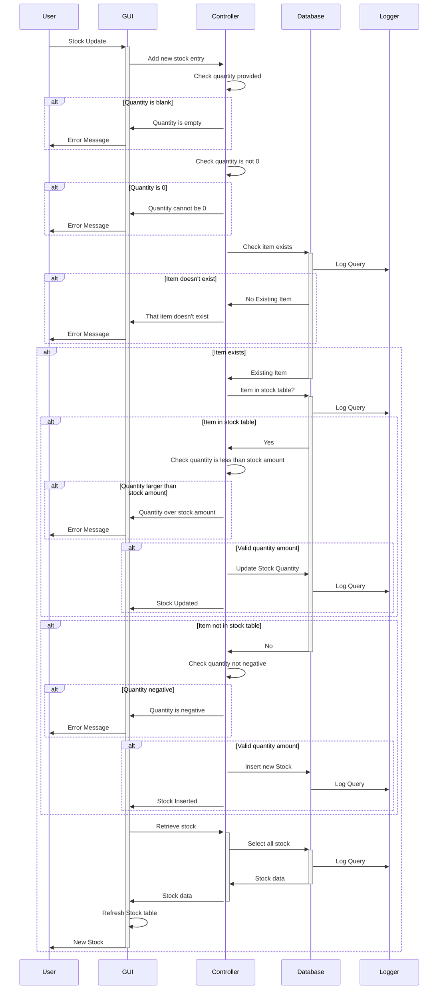

```mermaid
sequenceDiagram
    participant User
    participant GUI
    participant Controller
    participant Database
    participant Logger

    User->>+GUI: Stock Update
    GUI->>+Controller: Add new stock entry
    Controller->>Controller: Check quantity provided

    alt Quantity is blank
        Controller->>GUI: Quantity is empty
        GUI->>User: Error Message
    end

    Controller->>Controller: Check quantity is not 0
    alt Quantity is 0
        Controller->>GUI: Quantity cannot be 0
        GUI->>User: Error Message
    end

    Controller->>+Database: Check item exists
    Database->>Logger: Log Query
    alt Item doesn't exist
        Database->>Controller: No Existing Item
        Controller->>GUI: That item doesn't exist
        GUI->>User:Error Message
    end

    alt Item exists
        Database->>-Controller: Existing Item
        Controller->>+Database: Item in stock table?
        Database->>Logger: Log Query
        alt Item in stock table
            Database->>Controller: Yes
            Controller->>Controller:Check quantity is less than stock amount
            alt Quantity larger than stock amount
                Controller->>GUI: Quantity over stock amount
                GUI->>User: Error Message
            end
            alt Valid quantity amount
                Controller->>Database: Update Stock Quantity
                Database->>Logger: Log Query
                Controller->>GUI: Stock Updated
            end
        end
        alt Item not in stock table
            Database->>-Controller: No
            Controller->>Controller:Check quantity not negative
            alt Quantity negative
                Controller->>GUI: Quantity is negative
                GUI->>User: Error Message
            end
            alt Valid quantity amount
                Controller->>Database: Insert new Stock
                Database->>Logger: Log Query
                Controller->>GUI: Stock Inserted
            end
        end
        GUI->>+Controller: Retrieve stock
        Controller->>+Database: Select all stock
        Database->>Logger: Log Query
        Database->>-Controller: Stock data
        Controller->>-GUI: Stock data
        GUI->>GUI: Refresh Stock table
        GUI->>-User:New Stock
    end
```